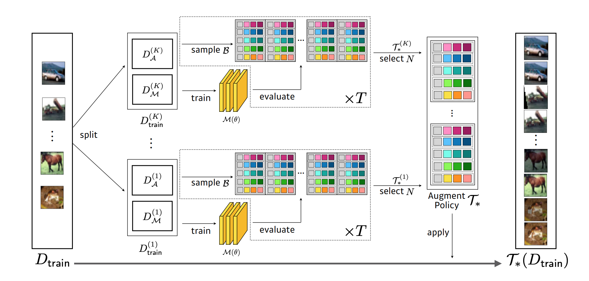
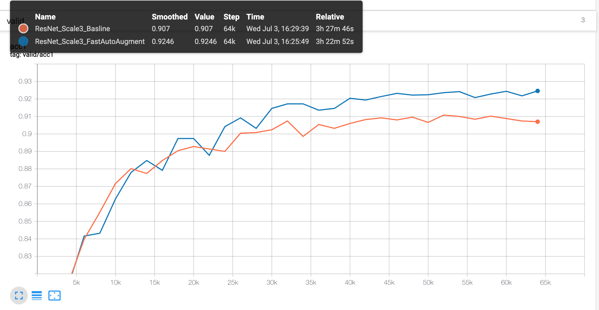
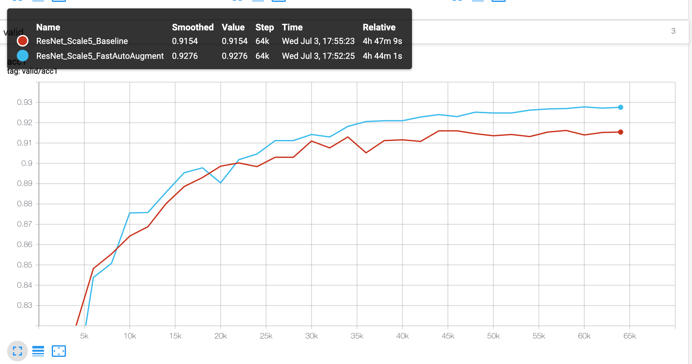
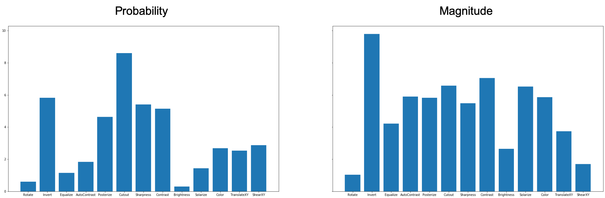
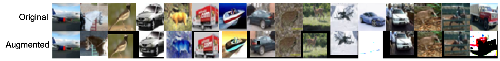
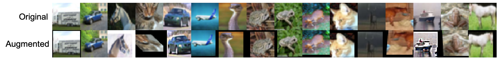

# Fast Autoaugment


A Pytorch Implementation of [Fast AutoAugment](https://arxiv.org/pdf/1905.00397.pdf) and [EfficientNet](https://arxiv.org/abs/1905.11946).

## Prerequisite
* torch==1.1.0
* torchvision==0.2.2
* hyperopt==0.1.2
* future==0.17.1
* tb-nightly==1.15.0a20190622

## Usage
### Training
#### CIFAR10
```bash
# ResNet20 (w/o FastAutoAugment)
python train.py --seed=24 --scale=3 --optimizer=sgd --fast_auto_augment=False

# ResNet20 (w/ FastAutoAugment)
python train.py --seed=24 --scale=3 --optimizer=sgd --fast_auto_augment=True

# ResNet20 (w/ FastAutoAugment, Pre-found policy)
python train.py --seed=24 --scale=3 --optimizer=sgd --fast_auto_augment=True \
                --augment_path=runs/ResNet_Scale3_FastAutoAugment/augmentation.cp

# ResNet32 (w/o FastAutoAugment)
python train.py --seed=24 --scale=5 --optimizer=sgd --fast_auto_augment=False

# ResNet32 (w/ FastAutoAugment)
python train.py --seed=24 --scale=5 --optimizer=sgd --fast_auto_augment=True

# EfficientNet (w/ FastAutoAugment)
python train.py --seed=24 --pi=0 --optimizer=adam --fast_auto_augment=True \
                --network=efficientnet_cifar10 --activation=swish
```

#### ImageNet (You can use any backbone networks in [torchvision.models](https://pytorch.org/docs/stable/torchvision/models.html))
```bash

# BaseNet (w/o FastAutoAugment)
python train.py --seed=24 --dataset=imagenet --optimizer=adam --network=resnet50

# EfficientNet (w/ FastAutoAugment) (UnderConstruction)
python train.py --seed=24 --dataset=imagenet --pi=0 --optimizer=adam --fast_auto_augment=True \
                --network=efficientnet --activation=swish
```

### Eval
```bash
# Single Image testing
python eval.py --model_path=runs/ResNet_Scale3_Basline

# 5-crops testing
python eval.py --model_path=runs/ResNet_Scale3_Basline --five_crops=True
```

## Experiments
### Fast AutoAugment
#### ResNet20 (CIFAR10)
* Validation Curve


* Evaluation (Acc @1)

|                | Valid | Test(Single) |
|----------------|-------|-------------|
| ResNet20       | 90.70 | **91.45**   |
| ResNet20 + FAA |**92.46**| **91.45** |

#### ResNet34 (CIFAR10)
* Validation Curve


* Evaluation (Acc @1)

|                | Valid | Test(Single) |
|----------------|-------|-------------|
| ResNet20       | 91.54 | 91.47       |
| ResNet20 + FAA |**92.76**| **91.99** |

### Found Policy [[Download]()]


### Augmented images


